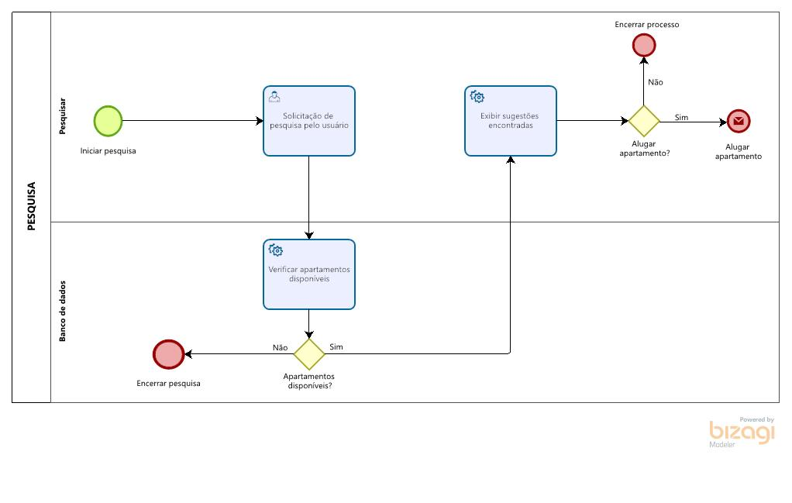
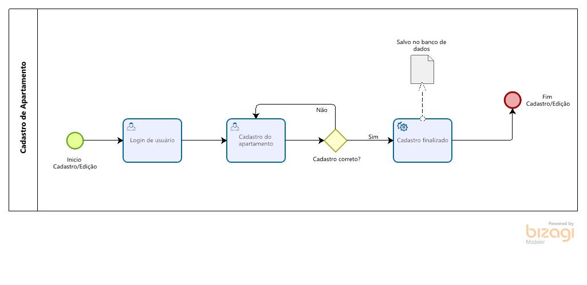
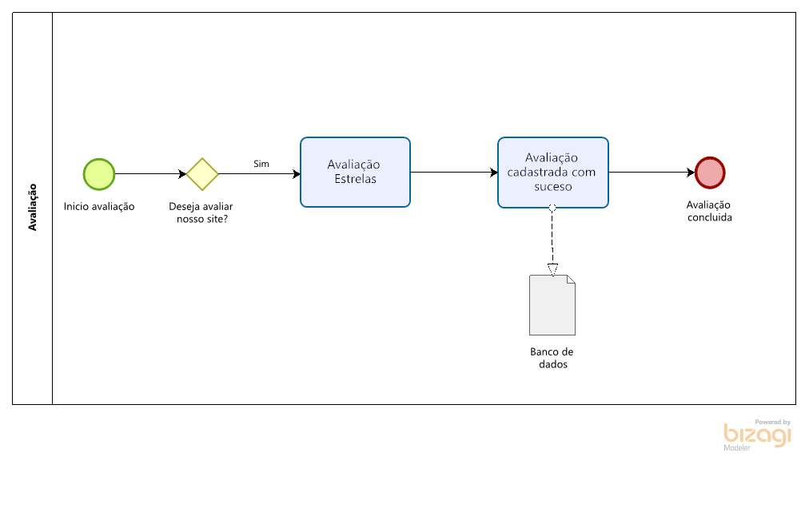
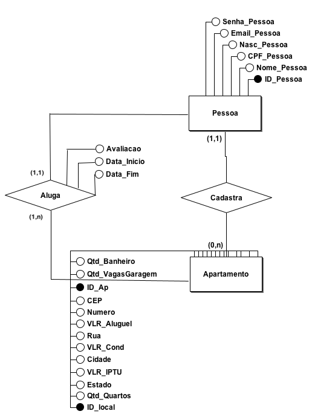
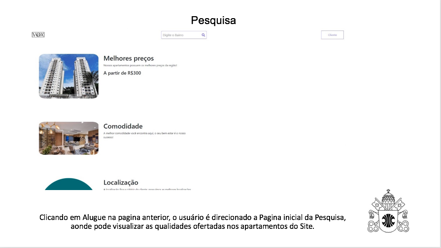
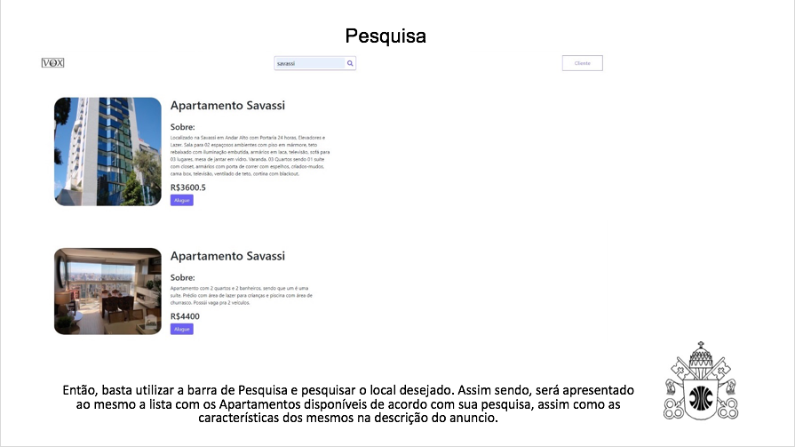
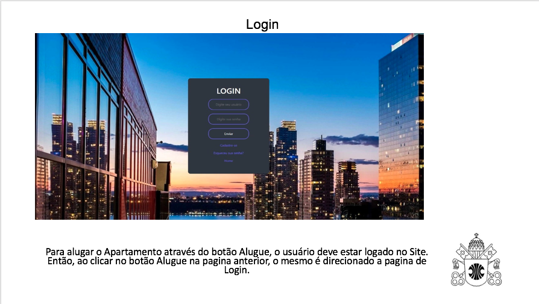
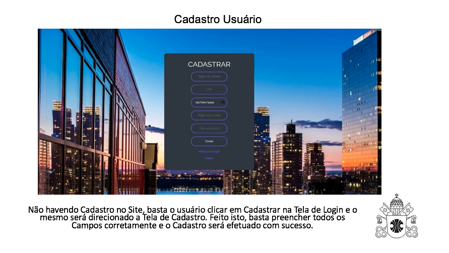
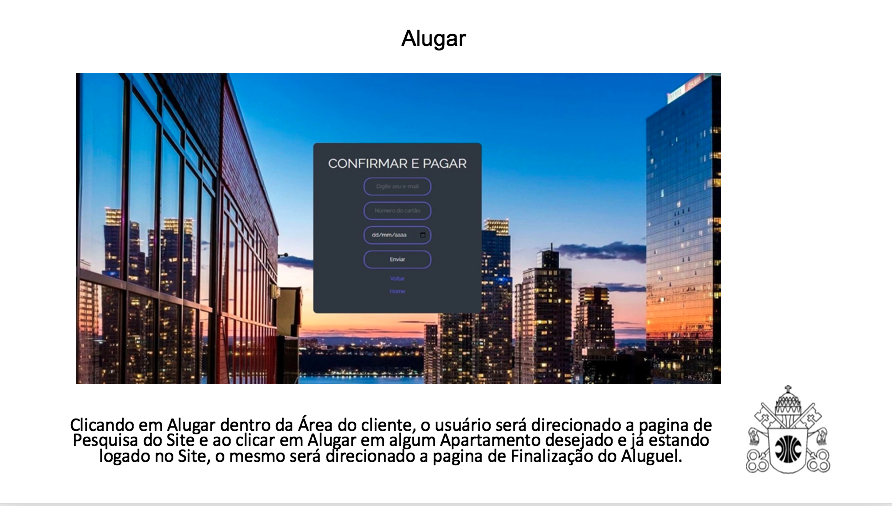
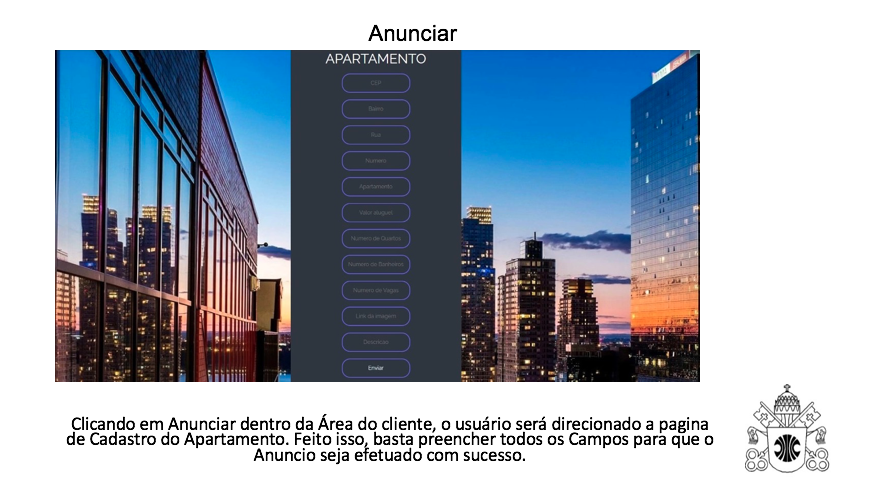

# VOX

Artur Santos Corradi de oliveira

Gabriel Rodrigues de Carvalho

Igor Rogério Soares Vasconcelos

Pedro de Sousa Motta

---

_Curso de Engenharia de Software, Unidade Praça da Liberdade_

_Instituto de Informática e Ciências Exatas – Pontifícia Universidade de Minas Gerais (PUC MINAS), Belo Horizonte – MG – Brasil_

---

_**Resumo**. Escrever aqui o resumo. O resumo deve contextualizar rapidamente o trabalho, descrever seu objetivo e, ao final, 
mostrar algum resultado relevante do trabalho (até 10 linhas)._

---

## 1. Introdução

1.1 Contextualização:  A VOX tem como objetivo tornar a locação de apartamentos algo mais fácil, agradável e seguro. Apresentando um serviço eficiente que permite proprietários anunciarem seus imóveis e que clientes busquem as acomodações que mais se encaixem em seu perfil, para isso será oferecido ferramentas que facilitarão a busca de cada usuário como barra de pesquisa, classificação de cada apartamento avaliado por cada usuário, lista de recomendados e o preço inicial de cada apartamento apresentado visando facilitar a negociação.

1.2 Problema: Percebemos que várias empresas tinham dificuldade em fazer propaganda de seus imóveis, de até mesmo aluga-los para as pessoas interessadas, sendo assim, tendo esse problema em vista, decidimos criar o VOX, focando principalmente nesses problemas que estavam sendo acarretados na hora de procurar por um prédio para se residir ou até mesmo alugar para passar suas férias.

1.3 Objetivo Geral: O objetivo desse projeto é desenvolver um software que possibilite a busca de apartamentos para serem alugados na região de Belo Horizonte, contendo imagens, descrições e a avaliação dos clientes. Além disso, será um meio para que os proprietários divulguem seus imóveis, priorizando os locais com as melhores avaliações e valores, visando a praticidade para ambos os lados.

1.3.1 Objetivos Especificos: Um dos objetivos do trabalho é tornar possível o cadastro, feito pelo proprietário, do apartamento que está disponível, para divulgar seu imóvel. Outro objetivo seria um local em que será feita a avaliação dos clientes após a hospedagem, servindo como critério de recomendação para as próximas buscas.

1.4 Justificativa: Entre as justificativas para o desenvolvimento deste trabalho podemos destacar a necessidade de aluguel de forma prática e com preços acessíveis, além disso, a necessidade de se obter uma variedade de locação na região de Belo Horizonte e por fim, a garantia de segurança no ato do aluguel.

## 2. Participantes do processo

Persona 1: Juliana Vale Guimarães
26 anos
possui um apartamento na Savassi. 
Juliana pretende alugar seu apartamento pois está cursando biomedicina na UFMG e gostaria de uma renda extra 
pretende alugar por temporada
o apartamento possui de 1 suíte, 1 sala, 1 cozinha e 1 garagem

Persona 2: Joao tem 31 anos, é professor de historia e trabalha com crianças do Ensino Fundamental. O mesmo possui grande afeição com a natureza e a energia que a mesma pode transmitir para si mesmo. Alem disso, é solteiro, e no seu tempo livre, vive fazendo pequenas viagens e conhecendo lugares históricos. Joao busca por um lugar tranquilo aonde o mesmo possa ter sua conexão com a natureza estabelecida. 

Persona 3: Guilherme Rodrigues
34 anos
Possui um apartamento em Belo Horizonte
Pretende alugar o imóvel pois está parado há 1 anos sem conseguir alugar e precisa de um aplicativo para facilitar o contato dele com o cliente.

Persona 4: Lucas Pereira
24 anos
Estudante de direito e precisa de uma localização agradevel e perto da faculdade para morar. Precisa de um aplicativo para facilitar a busca por um apartamento que se encaixe em suas requisições. 

## 3. Modelagem do processo de negócio

## 3.1. Análise da situação atual

A dificuldade de alugar apartamentos, de pesquisar pelos
mesmos e de contato entre o cliente e o dono são os 
principais problemas que viabilizam a proposta da VOX. Existe uma padronização no modelo de Sistema no qual iremos implementar. Basicamente, quando ocorre a procura por locais para aluguel, os usuários realizam seus respectivos cadastros em uma plataforma. Feito isso, lhe é apresentado um leque de opções para aluguel e de acordo com o gosto pessoal do determinado usuário, um aluguel é efetivado. A partir disso, são negociados as formas de pagamento para finalmente, o processo ser concluído. Nosso sistema basicamente tem por objetivo tais funções. No entanto, esperamos gerar uma experiência cada vez mais agradável ao cliente através de avaliações de apartamentos, entre outros.

## 3.2. Descrição Geral da proposta

A proposta inicial do projeto é criar um software que possibilite a comercialização de apartamentos, podendo ser utilizado pelo proprietário, para divulgar o seu imóvel, ou pelos clientes, para buscar um local para alugar. Nesse sentido torna-se uma limitação do nosso projeto a disponibilização de apartamentos localizados apenas na região de Belo Horizonte, porém o software terá funcionalidades que irão diversifica-lo dos demais aplicativos: 

* No software irá conter uma ferramenta para que os usuários realizem o seu cadastro na plataforma. Permitindo aos proprietários de imóveis, cadastrar apartamentos para alugar, e também aos demais usuários alugar apartamentos; 
*  Também irá conter uma barra de pesquisa para facilitar a busca do cliente por um apartamento na localização que deseja; 
*  Todos os dados do apartamento disponibilizado serão postos no site, de forma a descrever o ambiente e o endereço em que está localizado, facilitando a escolha do cliente com aquele que mais atende a suas necessidades; 
* As formas de pagamento serão feitas através do site pelo cartão de credito. Após sua realização todos os dados serão enviados ao e-mail cadastrado pelo cliente na plataforma, confirmando o procedimento realizado. 

### 3.3.1 Processo 1 – Cadastro e Login

O cadastro tem o objetivo de validar informações de forma rápida e eficiente, além disso ajuda a fidelizar os clientes. Também oferece uma organização maior tanto para quem quer colocar um apartamento para alugar tanto quanto para alugar um.

### 3.3.2 Processo 2 – Pesquisa

Pesquisa usada para pesquisar no banco de dados do site os apartamentos que melhor se adequam ao usuário.

### 3.3.3 Processo 3 – Cadastro de Apartamento

Cadastro de Apartamento, usado para efetivar o cadastro de apartamento, consequentemente a Categorização e alocação no Banco de Dados.

### 3.3.4 Processo 4 – Aluguel

Processo de alugar apartamento, o usuário deve preencher o formulario com os dados pessoais. Após preenchido os dados serão enviados para o email.

### 3.3.5 Processo 5 – Avaliação

A avaliação é o processo que irá medir e compartilhar a satisfação do cliente com o apartamento alugado, assim essa funcionalidade possibilitará  que os futuros clientes já tenham um feedback do apartamento e permitirá também que os proprietários corrijam possíveis defeitos do alojamento

## 4. Projeto da Solução

### 4.1. Detalhamento das atividades

Descrever aqui cada uma das propriedades das atividades de cada um dos processos. Devem estar relacionadas com o modelo de processo apresentado anteriormente.

#### Processo 1 – CADASTRO E LOGIN

**Cadastro de usuários**

| **Campo** | **Tipo** | **Restrições** | **Valor default** |
| --- | --- | --- | --- |
|Preencher dados| Caixa de texto | Dados corretos | N/A |
| Email | Caixa de Texto | Formato de email válido | N/A |
| Senha | Caixa de Texto | Mínimo de 8 caracteres | N/A |

**Preencher dados do Login**

| **Campo** | **Tipo** | **Restrições** | **Valor default** |
| --- | --- | --- | --- |
| Email |  Caixa de Texto  | Email cadastrado | N/A |
| Senha |  Caixa de Texto  | Senha válida, cadastrada | N/A |

#### Processo 2 – PESQUISA

**Pesquisar Bairros**

| **Campo** | **Tipo** | **Restrições** | **Valor default** |
| --- | --- | --- | --- |
| Pesquisar Bairros | Área de texto | Bairro de Belo Horizonte | N/A |

**Verificar apartamentos disponíveis**

| **Campo** | **Tipo** | **Restrições** | **Valor default** |
| --- | --- | --- | --- |
| Verificar apartamentos disponíveis | Arquivo | Filtros de pesquisa | N/A |

**Ver sugestões encontradas**

| **Campo** | **Tipo** | **Restrições** | **Valor default** |
| --- | --- | --- | --- |
| Ver sugestões encontradas | Imagem, texto, data, avaliação | Apartamentos disponíveis | Melhores avaliações |

#### Processo 3 - CADASTRO DE APARTAMENTOS

**Login de usuário**

| **Campo** | **Tipo** | **Restrições** | **Valor default** |
| --- | --- | --- | --- |
| Login de usuário | Caixa de texto | Login concluído | N/A |

**Cadastro de Apartamento**

| **Campo** | **Tipo** | **Restrições** | **Valor default** |
| --- | --- | --- | --- |
| CEP | Caixa de texto | Somente números | N/A |
| Bairro | Caixa de texto | Máximo de 1000 caracteres | N/A |
| Rua | Caixa de texto | Máximo de 1000 caracteres | N/A |
| Número | Caixa de texto | Somente números | N/A |
| Apartamento | Caixa de texto | Somente números | N/A |
| Valor aluguel | Caixa de texto | Somente a moeda Real ($) | N/A |
| Número de quartos | Caixa de texto | N/A | N/A |
| Número de banheiros | Caixa de texto | N/A | N/A |
| Número de vagas | Caixa de texto | N/A | N/A |
| Link da imagem | Caixa de texto | Máximo de 1000 caracteres | N/A |
| Descrição | Caixa de texto | Máximo de 1000 caracteres | N/A |

#### Processo 4 – Aluguel

**Preencher Formulario**

| **Campo** | **Tipo** | **Restrições** | **Valor default** |
| --- | --- | --- | --- |
| Número do cartão | Caixa de texto | Somente números | N/A |
| Validade | Caixa de texto | Somente números | N/A |
| Codigo de Segurança | Caixa de texto | Somente números | N/A |
| Nome | Caixa de texto | Máximo de 1000 caracteres | N/A |
| CPF | Caixa de texto | Somente números | N/A |
| Telefone | Caixa de texto | Somente números | N/A |

#### Processo 5 – AVALIAÇÃO

**Avaliação (Estrelas)**

| **Campo** | **Tipo** | **Restrições** | **Valor default** |
| --- | --- | --- | --- |
| Avaliação Estrelas | Caixa de Texto,imagem | 1 a 5 estrelas | 0 estrelas (N/A) |

**Comentário**

| **Campo** | **Tipo** | **Restrições** | **Valor default** |
| --- | --- | --- | --- |
| Comentário | Caixa de Texto | Usuário escolher esrever comentário | N/A |

**Avaliação concluída**

| **Campo** | **Tipo** | **Restrições** | **Valor default** |
| --- | --- | --- | --- |
| Avaliação concluída | Caixa de Texto, Data | Estadia completa e avaliação das estrelas (no mínimo) | N/A |

### 4.2. Tecnologias

JavaScript, HTML, CSS, jQuery, Visual Studio Code, Undraw, MySQL, PHP, phpMyadmin e WampServer.

## 5. Modelagem de dados

Apresente o modelo de dados. Defina o dicionário de dados com os respectivos formatos e significados.

### 5.1. Diagrama de Entidade-Relacionamento

Apresente aqui o Diagrama de Entidade-Relacionamento (DER) que contemple todos conceitos e atributos apresentados item anterior. Deve contemplar também o controle de acesso de usuários de acordo com os papeis definidos nos modelos do processo de negócio.

## 6. Indicadores de desempenho

Apresente aqui os principais indicadores de desempenho e algumas metas para o processo. Atenção: as informações necessárias para gerar os indicadores devem estar contempladas no diagrama de classe. Colocar no mínimo 5 indicadores.

Usar o seguinte modelo:

| **Indicador** | **Objetivos** | **Descrição** | **Cálculo** | **Fonte dados** | **Perspectiva** |
| --- | --- | --- | --- | --- | --- |
| Indicar a frequencia de uso | Identificar se o usuário utilizou o site mais de uma vez | Mede a relevancia do site para o cliente |   | Tabela Pessoa | Acompanhamento e satisfação do cliente |
| Indicar como está a satisfação do usuário em relação ao site | Melhorar a prestação de serviços medindo a avaliação do cliente | Armazena as avaliações individeais de satisfaçaõ do cliente |  | Tabela avaliação | Melhoria do site e correção de possiveis erros |
| Indicar o apartamento escolhido | Identificar se o apartamento está sendo escolhido | Mede a relevancia do apartamento para o site |   | Tabela Apartamento | Aumentar a quantidade de clientes |
| Indicar se o pagamento foi realizado | Identificar e confirmar a reserva do apartamento | Apresentar segurança ao cliente ao realizar o pagamento |   | Tabela Email Pessoa | Transparecer mais segurança ao cliente |
| Indicar os locais que são alugados com mais frequência | Identificar e dar maior visibilidade aos apartamentos mais relevantes | Apresentar os apartamentos e locais mais alugados |   | Tabela local | Apresentar os melhores e mais famosos apartamentos |

Obs.: todas as informações para gerar os indicadores devem estar no diagrama de classe **a ser proposto**

## 7.Sistema desenvolvido

## 8. Avaliação

Para realização da avaliação pedimos um usuário de fora da criação do software para avaliar e responder algumas perguntas.
De acordo com o usuário diante as perguntas realizadas foram: 
O site é intuitivo? -Sim principalmente a tela de início.
Você achou com facilidade ao procurar ou pesquisar algo?  -Sim, pude pesquisar por apartamentos e achei alguns, quando não havia nenhum apartamento no local onde pesquisei eu era informado.
Você teve dificuldade ao cadastrar seu usuário ou seu apartamento? -Não.
O site foi útil pra você? -Sim, achei bem simples de mexer e procurar o'que eu quero.
Você indicaria o site? -Sim.
Sua conclusão do site: O site me parece fácil e funcional, caso eu precise pesquisar sobre apartamentos disponíveis esse site seria eficaz e também se um dia eu quiser cadastrar um apartamento para alugar.

## 9. Conclusão

Durante a elaboração do projeto, desenvolvemos um Software em que as pessoas cadastram e alugam apartamentos de forma online, o Vox foi pensado de forma a facilitar a busca e o processo de aluguel para as pessoas interessadas. Com isto, além de colocar em prática diversos conhecimentos obtidos nas matérias Modelagem de processos de negócios e Banco de dados, tidas neste 3° semestre, foi possível, também, aperfeiçoar o aprendizado obtido em outros semestres, ao realizar este trabalho, pudemos compreender, na prática, todo o processo envolvido por trás dos back-end, o que agregou muito no nosso desenvolvimento e aprendizado.

# REFERÊNCIAS

Como um projeto de software não requer revisão bibliográfica, a inclusão das referências não é obrigatória. No entanto, caso você deseje incluir referências relacionadas às tecnologias, padrões, ou metodologias que serão usadas no seu trabalho, relacione-as de acordo com a ABNT.

Verifique no link abaixo como devem ser as referências no padrão ABNT:

http://www.pucminas.br/imagedb/documento/DOC\_DSC\_NOME\_ARQUI20160217102425.pdf

**[1.1]** - _ELMASRI, Ramez; NAVATHE, Sham. **Sistemas de banco de dados**. 7. ed. São Paulo: Pearson, c2019. E-book. ISBN 9788543025001._

**[1.2]** - _COPPIN, Ben. **Inteligência artificial**. Rio de Janeiro, RJ: LTC, c2010. E-book. ISBN 978-85-216-2936-8._

**[1.3]** - _CORMEN, Thomas H. et al. **Algoritmos: teoria e prática**. Rio de Janeiro, RJ: Elsevier, Campus, c2012. xvi, 926 p. ISBN 9788535236996._

**[1.4]** - _SUTHERLAND, Jeffrey Victor. **Scrum: a arte de fazer o dobro do trabalho na metade do tempo**. 2. ed. rev. São Paulo, SP: Leya, 2016. 236, [4] p. ISBN 9788544104514._

**[1.5]** - _RUSSELL, Stuart J.; NORVIG, Peter. **Inteligência artificial**. Rio de Janeiro: Elsevier, c2013. xxi, 988 p. ISBN 9788535237016._

# APÊNDICES

**Colocar link:**

Do código;

Dos artefatos;

Da apresentação final;

https://www.youtube.com/watch?v=2qmvIU-nR40

